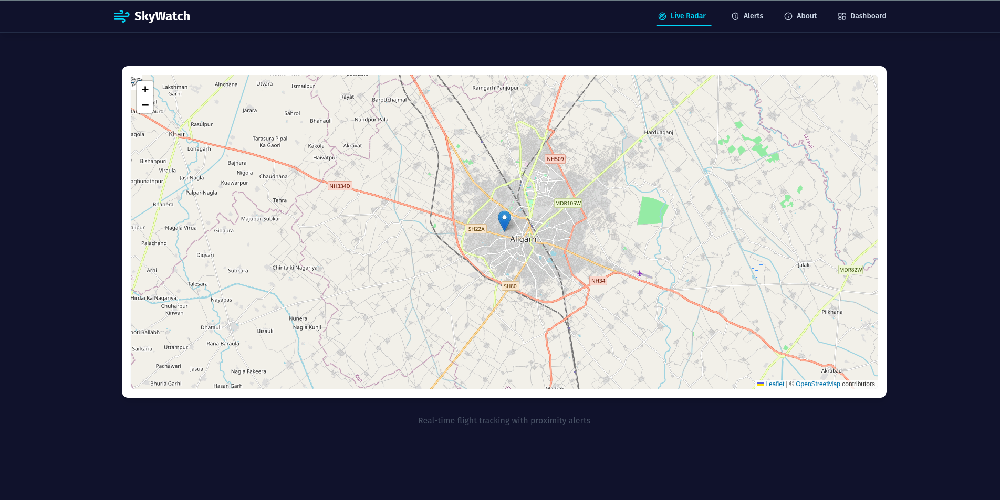
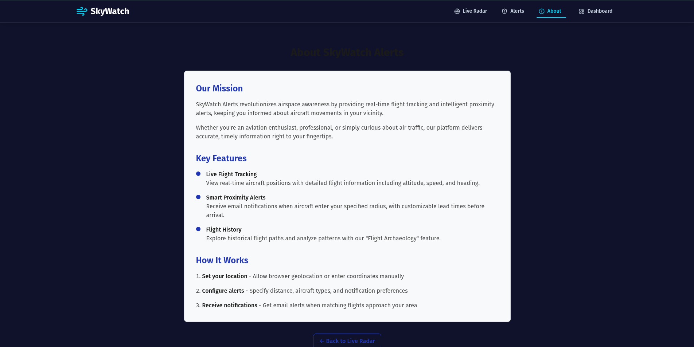
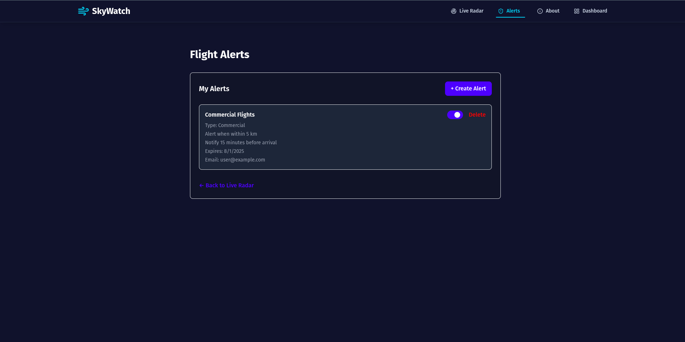

# ✈️ SkyWatch Alerts

**SkyWatch Alerts** is a real-time flight tracking and proximity alert system that keeps you informed about aircraft activity in your area. Perfect for aviation enthusiasts, drone pilots, researchers, or anyone curious about local air traffic.
---
## 🌟GSSoC'25


🌟 **Exciting News...**

🚀 This project is now an official part of GirlScript Summer of Code – GSSoC'25! 💻 We're thrilled to welcome contributors from all over India and beyond to collaborate, build, and grow *Skyeatch_alerts!* Let’s make learning and career development smarter – together! 🌟

GSSoC is one of India’s **largest 3-month-long open-source programs** that encourages developers of all levels to contribute to real-world projects while learning, collaborating, and growing together.

🌈 With **mentorship, community support**, and **collaborative coding**, it's the perfect platform for developers to:

- ✨ Improve their skills
- 🤝 Contribute to impactful projects
- 🏆 Get recognized for their work
- 📜 Receive certificates and swag!

🎉 **I can’t wait to welcome new contributors** from GSSoC 2025 to this Skywatch_alerts project family! Let's build, learn, and grow together — one commit at a time. 
---


## 🚀 Features

### 📡 Live Flight Tracking
Track aircraft in real-time, displaying key details such as:
- Altitude
- Speed
- Heading
- Aircraft model and flight number

### 🔔 Smart Proximity Alerts
Get notified when an aircraft enters a user-defined radius:
- Set your own geolocation or enter coordinates manually
- Customize lead times before aircraft arrival
- Receive alerts directly via email

### 📈 Flight History (Flight Archaeology)
Analyze past flight patterns:
- Browse historical flight paths
- Understand aircraft behavior over time
- Useful for research, safety checks, and enthusiasts

### 🛠️ How It Works

1. **Set Your Location**
   - Allow browser geolocation access **OR**
   - Manually enter coordinates (latitude & longitude)

2. **Configure Alerts**
   - Choose your alert radius (e.g. 10 km around your location)
   - Filter by aircraft type or altitude range (optional)
   - Set your preferred lead time for notifications

3. **Receive Notifications**
   - When a matching flight enters your defined area, you'll receive an email alert in real-time

## 📁 Project Structure
The repository follows a Next.js (App Router) structure with clearly separated app routes, components, hooks, and libraries.
```
skywatch_alerts/
├─ .github/                      # CI workflows and issue templates
├─ public/                       # Static assets served as-is
│  ├─ screenshots/               # App screenshots used in README
│  ├─ marker-icon.png            # Leaflet default marker assets
│  ├─ marker-icon-2x.png
│  └─ marker-shadow.png
├─ src/
│  ├─ app/                       # Next.js App Router (routes and layouts)
│  │  ├─ layout.tsx              # Root layout
│  │  ├─ globals.css             # Global styles (Tailwind base)
│  │  ├─ about/                  # About page
│  │  ├─ alerts/                 # Alerts page
│  │  ├─ contact/                # Contact page
│  │  ├─ Dashboard/              # Dashboard page
│  │  ├─ feedback/               # Feedback page/route
│  │  ├─ profile/                # Profile page
│  │  └─ api/                    # Route handlers (serverless API)
│  │     ├─ flights/route.ts     # Proxy to ADS-B/flight data API
│  │     └─ feedback/route.ts    # Append feedback to temp_DB/response.txt
│  ├─ components/                # Reusable UI and layout components
│  │  ├─ layout/Navbar.tsx       # Top navigation bar
│  │  ├─ Footer.tsx              # Site footer
│  │  ├─ Header.tsx              # Page header
│  │  └─ ui/button.tsx           # Shared button component
│  ├─ hooks/                     # Custom React hooks
│  │  ├─ UseAuth.tsx             # Firebase auth hook/provider
│  │  └─ useLocation.ts          # Browser geolocation hook
│  ├─ lib/                       # Client libraries and integrations
│  │  └─ flights/
│  │     ├─ adsbClient.ts        # Fetch and normalize nearby flights
│  │     └─ firebase.js          # Firebase client/config
│  └─ types/
│     └─ flight.ts               # TypeScript types for flight data
├─ temp_DB/
│  └─ response.txt               # Temp storage for feedback submissions
├─ eslint.config.mjs             # ESLint configuration
├─ next.config.ts                # Next.js configuration
├─ postcss.config.mjs            # PostCSS (Tailwind CSS) config
├─ tailwind config (via package) # Tailwind v4 (plugin-based)
├─ tsconfig.json                 # TypeScript configuration
├─ package.json                  # Scripts and dependencies
```
- API routes under `src/app/api/*` run on the server (Edge/Node) and can safely call third-party services.
- Flight data proxy: `api/flights/route.ts` fetches data from `https://api.adsb.lol/` and normalizes it via `src/lib/flights/adsbClient.ts` on the client.

## 📦 Tech Stack

- **Frontend**: React / Tailwind CSS / Leaflet.js (Map Rendering)
- **Backend**: Node.js / Express.js
- **Database**: MongoDB (Flight logs, user settings)
- **Flight Data Source**: [OpenSky Network](https://opensky-network.org/) or similar real-time aviation data API
- **Email Notifications**: NodeMailer / SendGrid
- **Geolocation**: HTML5 Geolocation API / Manual entry

## 🚀 Quick Start
### Prerequisites

- Node.js (v14 or higher)
- MongoDB (local installation or MongoDB Atlas account)
- npm or yarn

### Installation
Checkout [LEARN.md](LEARN.md)


## 🧪 Use Cases

- **Spotting local aircraft activity**
- **Drone pilot airspace awareness**
- **Aviation research or education**
- **General curiosity about flights above you**

## 🔧 Additional Setup Details
**Getting API Credentials**
- OpenSky Network API
   1. Register at https://opensky-network.org/
   2. Free accounts have limited requests per day

- Mapbox Access Token
   1. Create a free account at https://www.mapbox.com/
   2. Generate an access token from your account dashboard

- Email Service Setup  <br>
   For Gmail, you'll need to generate an App Password:
  1. Enable 2-factor authentication on your Google account
  2. Go to Google Account Settings > Security > App passwords
  3. Generate a password for SkyWatch Alerts

## 📸 Screenshots

### 🏠 Home Page



---

### ℹ️ About Page



---

### 🚨 Alert Page




## Upcoming Updates
Looking to contribute? Here are a few beginner-friendly areas where you can help improve the project:

- Integrating a persistent **database** (e.g. MongoDB for storing user preferences and alerts)
- Adding **real-time alert systems** (email, WhatsApp, or push notifications)
- Enhancing **map features** (e.g. better markers, aircraft paths, clustering)
- Adding unit and integration **tests**
- Improving the **UI/UX design** and responsiveness

## Contributing

Pull requests are welcome! If you’re unsure where to start, check out the **Upcoming Updates** section above or open an issue.

If you find this project helpful, please consider giving it a ⭐ **star** to support its development and visibility!


## ⚠️ Disclaimer

SkyWatch Alerts is for **informational purposes only**. It should not be used for critical aviation decisions or safety-sensitive operations. Always rely on official aviation authorities for flight safety information.

## 📄 License

This project is licensed under the MIT License - see the [MIT License](LICENSE) file for details.

## ❓ Troubleshooting
Common issues and solutions:

- Connection to MongoDB fails
   Ensure MongoDB is running locally or your MongoDB Atlas connection string is correct

- Map doesn't display
   Verify your Mapbox access token is correctly set in the frontend .env file

- Email notifications not working
   Check your email service credentials in the backend .env file
   For Gmail, ensure you're using an App Password, not your regular password

- Flight data not loading
   Verify your OpenSky API credentials are correct

## ⭐ Support the Project
If you find this project useful, please give it a star on GitHub!

---